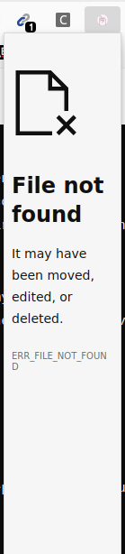

# Udemy Video Preloader Chrome Extension

## Description
This Chrome extension preloads Udemy videos to prevent interruptions during playback by ensuring the entire video is loaded in advance.

## Features
- Automatically preloads Udemy course videos.
- Enhances user experience by reducing interruptions during playback.

## Installation
### Manual Installation
1. Download the latest `.crx` file from the Releases page.
2. Open Chrome and navigate to `chrome://extensions/`.
3. Drag and drop the downloaded `.crx` file onto the extensions page to install the extension.

### Developer Mode (For Testing)
1. Clone or download this repository.
2. Open Chrome and navigate to `chrome://extensions/`.
3. Enable "Developer mode" in the top right corner.
4. Click on "Load unpacked" and select the directory containing the extension files (`manifest.json`, `content.js`, etc.).

## Usage
- Once installed, simply navigate to any Udemy course video page.
- The extension will automatically preload the video to prevent interruptions during playback.

## Screenshots (Optional)

## Contributing
Contributions are welcome! Please fork the repository and submit a pull request with your enhancements.

## License
This project is licensed under the [MIT License](LICENSE).
